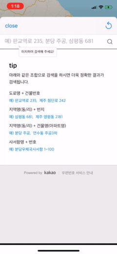

# TripDo
코로나때문에 가기 힘들어진 여행의 계획을 미리 짜보고 미리 루트를 확인할 수 있는 여행 투두앱 입니다.

코어데이터를 활용하여 비 로그인 상태로 사용자의 데이터를 저장하지 않는 컨셉으로 개발하게 되었습니다.

## Architecture

- MVC(리팩터링 필요)

## Requirements
- **Language**
  - Swift 5.0
- **Framework**
  - UIKit
  - CoreData
  - CocoaPods
  - SPM(SwiftPackageManager)
- **IDE**
  - Xcode

## Libraries
프로젝트내에서 사용한 라이브러리 목록 입니다.

| Pod | SPM |  
|:---:|:---:|
| [Firebase Analytics](https://firebase.google.com/docs/analytics/ios/start?hl=ko) | [Snapkit](https://github.com/SnapKit/SnapKit#contents) |

## CoreData diagram

## App Demo

    

---

### 회고

iOS개발을 시작하면서 처음으로 혼자서 앱을 기획하고, 개발하며 앱스토어에 배포까지 하게된 App입니다.

처음엔 어떻게 시작해야될지 막막하다가 막상 또 개발을 시작하니 거의 한달 내내 쉼없이 진행하였고, 드디어 앱스토어에 배포를 하게 되었습니다.

개발을 진행하면서 애먹었던 부분은 달력, 코어데이터(CRUD), 폴리라인 및 어노테이션등 생각보다 배포를하려다보니 신경써야 할 부분들이 많이 생겼습니다.`아직도 수정할 부분이 산더미이지만..`

프로젝트를 진행하면서 프로젝트 시작시에 MVC로 코드를 분리하여 정리하려 하였지만 아직 디자인패턴에 익숙하지 않은 상태에서 한정된 시간에서 시간에 쫓기다보니 생각처럼 쉽지 않았습니다.`이것도 아니고 저것도 아닌상태?가 되었습니다`

그래도 기획부터 배포까지 앱 개발의 한 사이클을 다 돌아봤다는것이 저에게는 가장 큰 경험이 되었다고 생각합니다.

